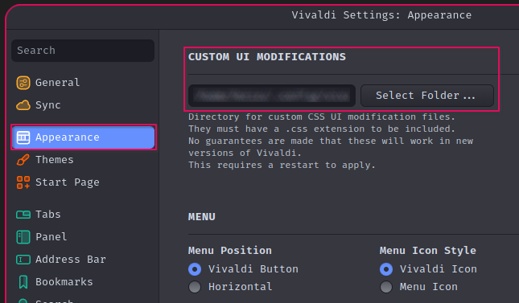

# char2workspace

A Vivaldi script for setting unicode as workspace icons


### Install

```
git clone github.com/Traube1000101/char2workspace
cd char2workspace
./patch-vivaldi
```

### Usage

1. Open the `select Workspace Icon` menu and the `Emoji` tab
2. Inspect window.html at
```
vivaldi://inspect/#apps
```
4. Open console and run the following
   dsdsadad
```
emoji2workspace("SOME-UNICODE ")
```
&#8193;&#8193;To center certain unicode icons you can specify a spacing on the right (1-7)

```
emoji2workspace("", 5)
```

### Optional

Link patch-vivaldi for easier reinstalling of the script after Vivaldi updates

```
sudo ln -s $(realpath ./patch-vivaldi) /usr/bin/
```

Set the `css` directory as your `custom ui modifications` directory to use `FiraCode Nerd Font`

